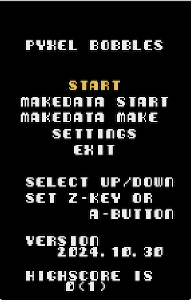
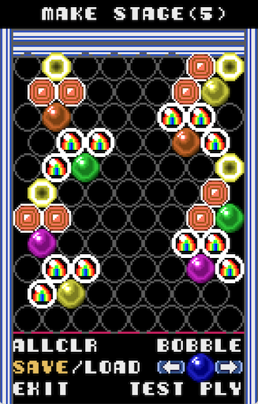

# Pyxel Bobbles v.1.5

## v.1.5 更新内容
- マップエディタ機能追加  
　　アプリケーションファイル（pyxapp）で起動した時に使用可能  
　　（Pyxel 2.2.6.で追加された機能を使用しています）  
　　下記動作確認のHTML版では使用できません（再起動すると消えます）  
　　マップエディタで作成したステージはタイトルから遊ぶことができます  
　　マップエディタで作成したステージはロードして編集が可能です  
　　保存するステージ数に上限はありません  
　　※あまりデバッグしてないのでバグがあるかもしれません
 - コンティニュー機能追加  
## 概要
- ゲーム内容はパズルボブルタイプのゲーム。  
- 設定にて、マルチカラーと16色モードが選べます。  
- 効果音は、frenchbreadさん作成の「Pyxel RPG SE パック」を使用しています。  
  
## スクリーンショット
  
  
  
## GIFアニメ
  
## 動作確認
- [URL](https://sanbunnoichi1962.web.fc2.com/pyxel/pyxelpb15.html)  
  
## 更新履歴
2024.10.31 マップエディタ作成  
2024.10.26 新規追加  
